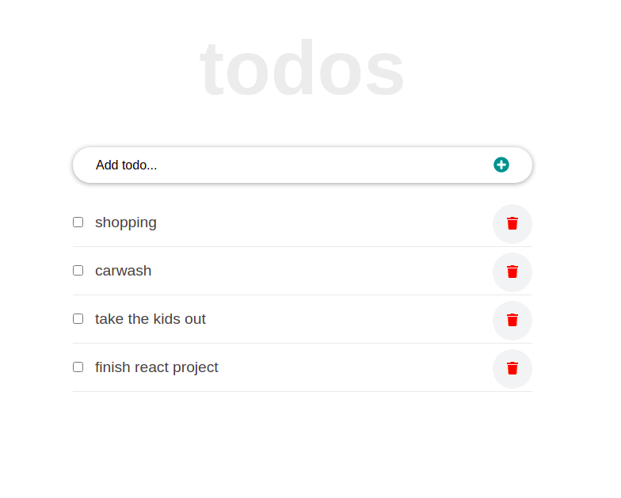

 

# React-Todo-App
 This todo App helps you to organize a list of tasks you need to complete, or things that you want to do. It helps you to organize tasks in order of priority, remove completed tasks, and reorganize tasks. This app is build with React, as JavaScript Library. 

features:
- Interface to add a task 
- Tick a task as complete
- Update the local storage
- Add a task through the input textbook
- Delete a completed tasks

## Built With

- React
- Webpack
- Babel

## Live Demo

[Live Demo Link]
- Still under development

## Getting Started

### Prerequisites

- node.js
- Javascript
- Git and Github
- Terminal
- browser

### Setup

- clone the following repo link, git@github.com:Mihndim2020/React-Todo-App.git
- cd into the directory and run npm install to install dependencies
- run npm run build
- run npm start

### Usage

- run index.html in your favorite browser to display the interface.

## Author

👤 **Mih Julius Ndim **

- Github: [@Mihndim2020](https://github.com/Mihndim2020)
- Twitter: [@mihndim](https://twitter.com/mihndim) 
- Linkedin: [Mih Julius](https://www.linkedin.com/mih-julius)

## Show your support

Give a ⭐️ if you like this project!

## Acknowledgments

- Hat tip to anyone whose code was used
- Inspiration
- etc

## 📝 License

This project is [MIT](https://github.com/Mihndim2020/To-Do-List/blob/develop/LICENSE) licensed.
